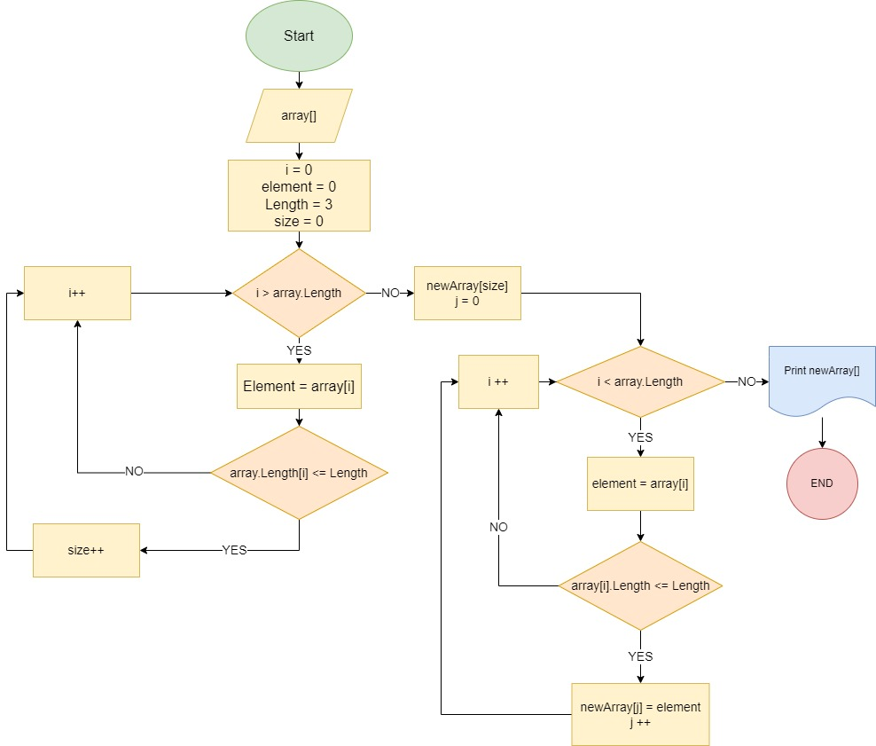

# **Итоговая задание первой четверти на курсе разработчик.** 

## **Что нужно сделать?**

1. Создать Репозийторий на Github
2. Нарисовать блок - схему программы
3. Написать README.md, чем я собственно и занимаюсь.
4. Написать программу которая рещает задачу.
5. Использовать контроль версий над роботой с этим проэктом.

## **Какое задание нам нужно сделать ?**

__*Задача: Написать программу, которая из имеющегося массива строк формирует новый массив из строк, длина которых меньше, либо равна 3 символам. Первоначальный массив можно ввести с клавиатуры, либо задать на старте выполнения алгоритма. При решении не рекомендуется пользоваться коллекциями, лучше обойтись исключительно массивами.*__

**Примеры:**\
*[“Hello”, “2”, “world”, “:-)”] → [“2”, “:-)”]*\
*[“1234”, “1567”, “-2”, “computer science”] → [“-2”]*\
*[“Russia”, “Denmark”, “Kazan”] → []*

# Наченм по порядку: # 

1. Репозиторий https://github.com/Mitiskyn/FinalTaskByMitiskyn
2. Вот Блок-Схема: 

3. README вы сейчас читаете значит все хорошо.
4. Программа в Папочке так а именно в Program.cs , заходите и спотрите на здоровье.
5. Контролем версеей пользуюсь, commit все есть.
